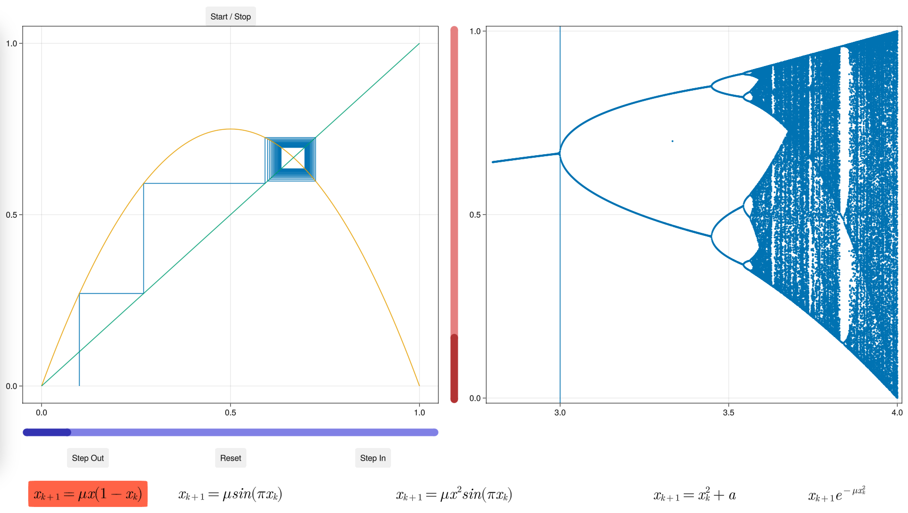
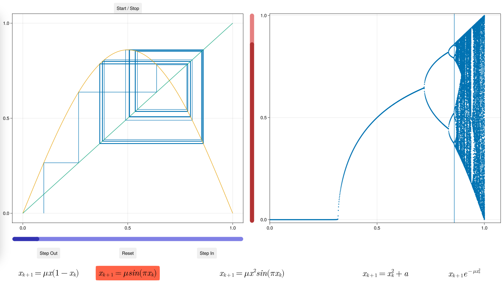
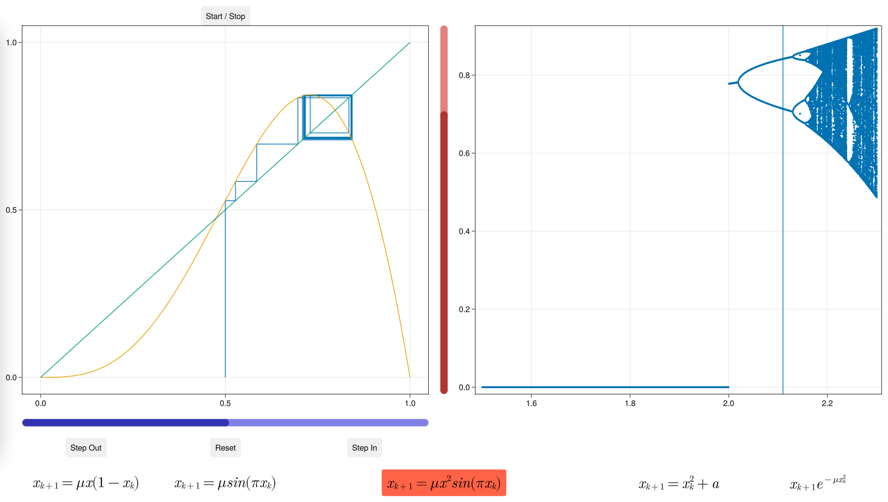
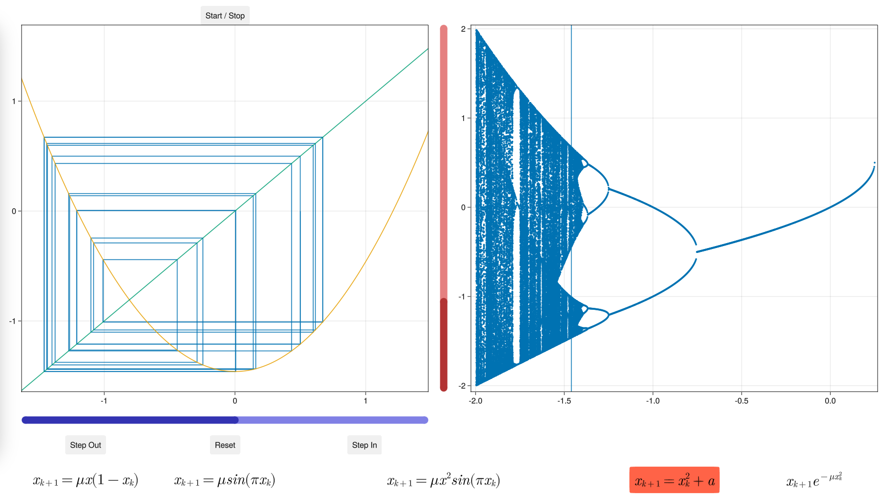
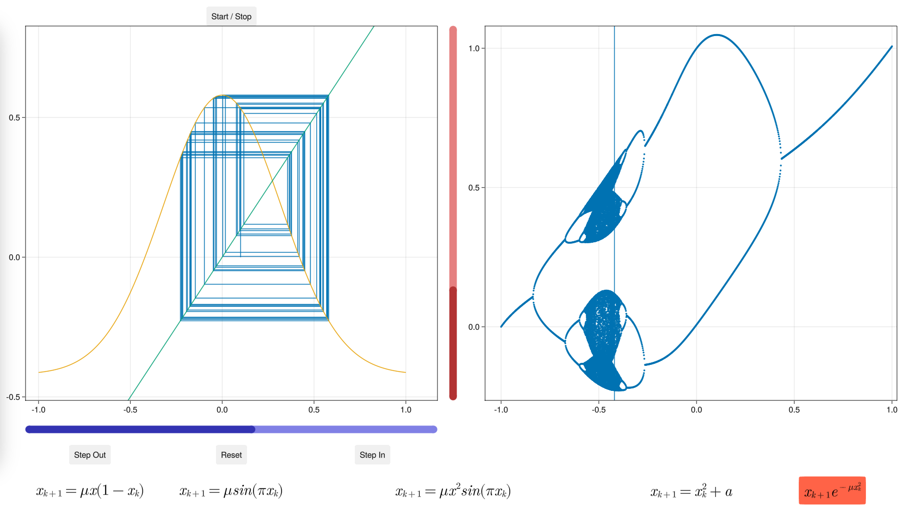

# WELCOME TO C~~h~~A~A~aO$0$oo$
### (Unidimensional Discrete Dynamic Systems)

---

## Available equations ~and~ ~its~ ~initial~ ~values~

#### $x_{k+1} = \mu x_k (1 - x_k)$
-	$2.8 \le \mu \le 4$
-	$0 \le x \le 1$
	-	$x_0$ = $0.1$
#### $x_{k+1} = \mu sin (\pi x_k)$
-	$0 \le \mu \le 1$
-	$0 \le x \le 1$
	-	$x_0$ = $0.1$
#### $x_{k+1} = \mu x^2sin (\pi x_k)$
-	$1.5 \le \mu \le 2.3$
-	$0 \le x \le 1$
	-	$x_0$ = $0.5$
#### $x_{k+1} = x^2 + \mu$
-	$-2 \le \mu \le 1/4$
-	$-\infty \le x \le \infty$
	-	$x_0$ = $0.5$
#### $x_{k+1} = e^{-4.9 x^2} + \mu$
-	$-1 \le \mu \le 1$
-	$-1 \le x \le 1$
	-	$x_0$ = $0.1$

## How to use

Run [main.jl](UnidimensionalDiscreteDynamicSystem/main.jl) using Julia, inside project folder:
```
julia -i main.jl
```
You can also run it step by step using an IDE.

## Features

-	Equation can be changed using the buttons.
-	Initial conditions can be changed using the sliders
	-	Right to change $\mu$
	-	Bottom to change intial $x$
-	Feigenbaum diagrams are precompiled and stored in [feigenbaum_data](UnidimensionalDiscreteDynamicSystem/feigenbaum_data/)
-	Feigenbaum diagrams are calculated according to the equation FIRST initial values.
	-	Changing $\mu$ ~~for obvious reasons~~ does not change the diagram
	-	Changing $x$ does not chgange de diagram

---

# Examples

$x_{k+1} = \mu x_k (1 - x_k)$



$x_{k+1} = \mu sin (\pi x_k)$



$x_{k+1} = \mu x^2sin (\pi x_k)$



$x_{k+1} = x^2 + \mu$



$x_{k+1} = e^{-4.9 x^2} + \mu$



# If you are still thirsty and need more C~~h~~A~A~aO$0$oo$ try this [Amazing Repo](www.github.com/dVaGaymer/fract-ol)

more to come...
