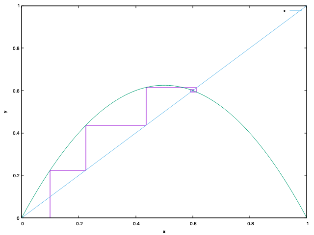

# Logistic Equation

$$x_{k+1}=\mu x_k(1-x_k);	0\leq x\leq 1$$

---

### Ej1 - Graphical solution to  $\mu=2.5,x_o=0.1$

[Solved](https://github.com/dVaGaymer/EDF/blob/main/ej1.plot) using gnuplot

### Ej2

[Solved](https://github.com/dVaGaymer/EDF/blob/main/ej2.plot) using gnuplot

### Ej3

[Solved](https://github.com/dVaGaymer/EDF/blob/main/ej3.plot) using gnuplot

By changing to different values of $\mu$ we can see how $x=\frac{(\mu - 1)}{\mu}$ is always an atractor
